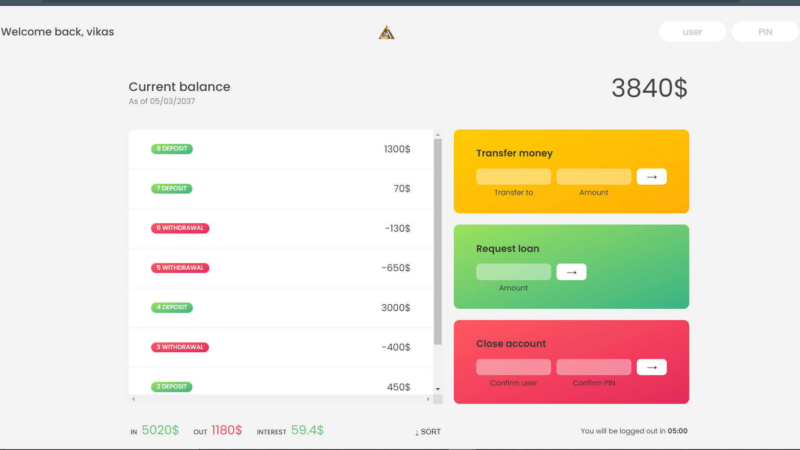

# Simple Bankist website

 

## ✨ Requirements

- Any Operating System (ie. MacOS X, Linux, Windows)
- Any IDE with installed (ie.Brackets , Atom, VSCode etc)
- A little knowledge of Dart and Flutter.

## 🚀 How to use it

- Use user name sj and pin 1111.
- Then press arrow button.
- It contains 4 accounts data with pin in script.js
- When transferring money another account use first letter of owner name and sure name.
